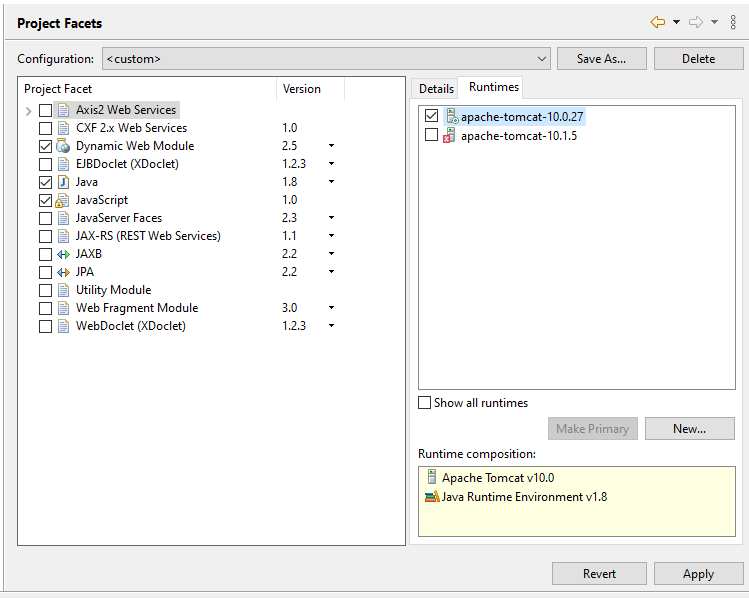
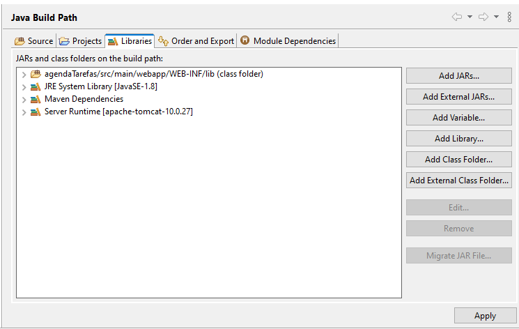
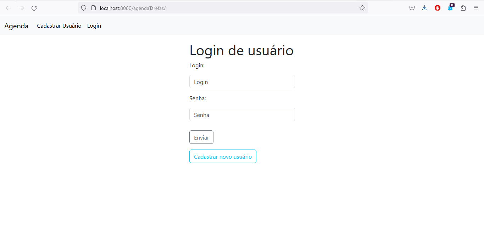
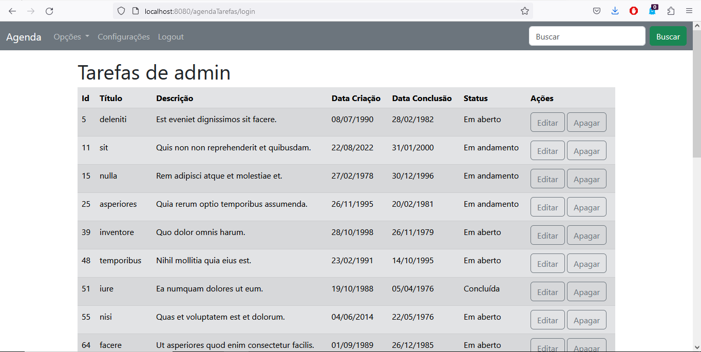
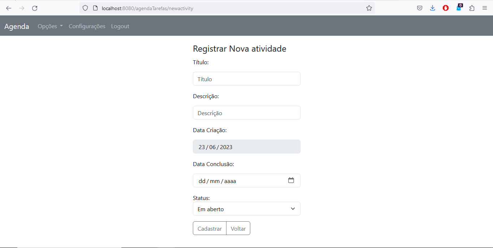
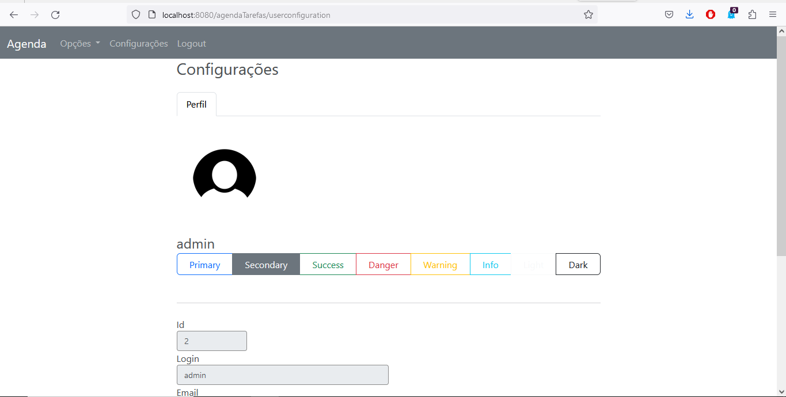

Descrição do projeto
 Aplicação web simples de lista de tarefas. Nessa aplicação, os usuários poderiam cadastrar, atualizar e excluir tarefas, além de marcar as tarefas como concluídas.
 Estruturação da Aplicação
 1. Banco de dados:
   - Tabela "usuarios" com os campos id, login, senha, nome e email.
        CREATE TABLE `usuarios` (
        `id` int(11) NOT NULL AUTO_INCREMENT,
        `login` varchar(45) NOT NULL,
        `email` varchar(200) NOT NULL,
        `password` varchar(400) NOT NULL,
        `preference` varchar(45) DEFAULT '0',
        PRIMARY KEY (`id`)
        ) ENGINE=InnoDB DEFAULT CHARSET=utf8mb4;
   - Tabela "tarefas" com os campos id, titulo, descricao, data_criacao, data_conclusao e status.
      CREATE TABLE `tarefas` (
        `id` int(11) NOT NULL AUTO_INCREMENT,
        `titulo` varchar(45) NOT NULL,
        `descricao` varchar(45) NOT NULL,
        `data_criacao` date NOT NULL,
        `data_conclusao` date NOT NULL,
        `status` int(11) NOT NULL DEFAULT 0,
        `user` int(11) NOT NULL,
        PRIMARY KEY (`id`)
        ) ENGINE=InnoDB DEFAULT CHARSET=utf8;

2. Páginas JSP:
   - Página de login: formulário de login com usuário e senha.
   - Página principal: listagem das tarefas cadastradas e opção de cadastrar novas tarefas.
   - Página de cadastro de tarefa: formulário para cadastrar uma nova tarefa.
   - Página de edição de tarefa: formulário para editar uma tarefa existente.
   - Página de configurações do usuário: formulário para escolher o tema ou alterar a senha.
   
3. Implementação dos Servlets:
   - Servlet de login: verifica se o usuário e senha são válidos e redireciona para a página principal.
   - Servlet de logout: encerra a sessão do usuário.
   - Servlet de listagem de tarefas: busca as tarefas cadastradas no banco de dados e as exibe na página principal.
   - Servlet de cadastro de tarefa: insere uma nova tarefa no banco de dados.
   - Servlet de edição de tarefa: atualiza uma tarefa existente no banco de dados.
   - Servlet de exclusão de tarefa: remove uma tarefa do banco de dados.

4. Implementação de Sessão
    - A sessão deve ser usada para armazenar informações relevantes para a agenda, como o nome do usuário logado, as preferências de exibição ou os eventos adicionados pelo usuário.
    - Após o login do usuário sempré é verificado se ele está logado, caso contrário apresenta-se a tela de login. Não é possível que o usuário acesse as páginas de tarefas, detalhes, exclusão, edição, adição (CRUD) sem estar logado ao sistema.
    - Criada opção para o usuário sair da sessão (sign off) quando tiver terminado suas atividades.

5. Design: Utilização do bootstrap 5.3.0

6. Servidor: apache-tomcat-10.0.27
7. Java: 1.8
8. Dynamic Web Module: 2.5

9. Utilização da biblioteca taglib, importação feita manualmente

10. Camada de Segurança utilizando a biblioteca BCrypt
    -  Hash unidirecional

11. Aprimoramento da Agenda 
    - Recursos de pesquisa e filtragem: permite que o usuário encontre facilmente eventos ou compromissos específicos na agenda.
    - Personalização: permite que o usuário personalize sua agenda de acordo com suas preferências, com a escolha de tema.

12. Telas:

